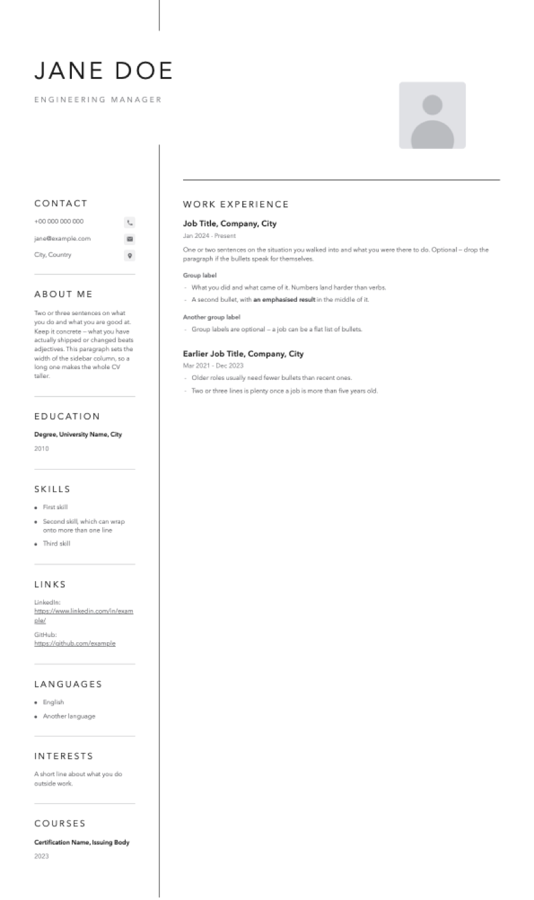

# CV maker

Make a good-looking CV as a **single-page PDF** — one continuous page, so no job
gets cut in half by a page break.

You don't need to know how to code. You need Chrome and about ten minutes.



## What you get

- **One page, however long your CV is.** No awkward breaks, no half a job at the
  bottom of page 1.
- **Real text, not a picture.** Recruiters' systems can read it, and so can
  search. You can select and copy from it.
- **Sharp at any zoom, and tiny.** Usually around 130 KB.
- **Yours.** No account, no subscription, no watermark, no site that locks the
  download behind a paywall.

## Before you start

You need **Google Chrome** installed. That's it. (Chromium and Edge also work.)

On Windows, run the commands below in Git Bash or WSL.

## Making your CV

**1. Download this project.** Green *Code* button above → *Download ZIP* →
unzip it. Open a terminal in that folder.

**2. Write your content.** Open `content-example.txt` in any text editor. It's a
fill-in-the-blanks CV — name, contact, skills, jobs. Replace the placeholder
text with your own and save it.

**3. Turn it into a CV.** Two ways:

> **The easy way.** Open ChatGPT or Claude. Attach your filled-in text file and
> `template.html`, and ask:
>
> *"Build my CV from this text using this template. Keep the template's layout
> and styling, only replace the content. Give me back the complete HTML file."*
>
> Save what it gives you as `cv.html` in this folder.

> **By hand.** Copy `template.html` to `cv.html` and type your details over the
> placeholder text. It's ordinary HTML — if you can edit a web page, you can
> edit this. The example content shows you what goes where.

**4. Render it.**

```bash
./render.sh
```

Your PDF appears in the `out` folder. Done.

Changed something? Run `./render.sh` again. It takes a second.

## Your photo

Replace `photo.jpg` with your own, keeping the same filename. Square works best
— 400×400 pixels or larger. A smaller one will look soft when printed.

Don't want a photo? Delete this line from your `cv.html`:

```html

```

## Several versions of your CV

Applying for different kinds of roles usually means different CVs. Just make
more files — `cv.html`, `cv-manager.html`, `cv-czech.html` — and run
`./render.sh` once. It renders all of them.

Your own files never end up in this project's history if you publish it
somewhere; they're excluded automatically.

## Two things to know before you send it

**It won't print nicely on A4.** The page is as tall as your CV, so a printer
either shrinks it or splits it across sheets. For sending by email or uploading,
that's fine. For handing someone a printed copy, see below.

**A few job portals check page size** and may complain about an unusual one.
Rare, but if a site rejects the file, that's the reason.

Need an ordinary multi-page A4 file instead? Open your `cv.html`, delete the
`<script>` block at the very bottom, and add this line just above `</style>`:

```css
@page { size: A4; margin: 15mm; }
```

Render again and you'll get a normal paginated PDF.

## If something goes wrong

| What you see | What to do |
|---|---|
| `No Chrome/Chromium found` | Install Google Chrome, or run `CHROME=/path/to/chrome ./render.sh` |
| `No cv*.html found` | You skipped step 3 — there's no `cv.html` in the folder yet |
| `WARNING: expected a single page` | Rare. Tell us in an issue and include your `cv.html` |
| `permission denied` running the script | Run `chmod +x render.sh` once |
| Photo looks blurry | Use a bigger image — 400×400 or more |
| Your text isn't showing up | You edited `template.html` instead of `cv.html` |

## Only have screenshots of an old CV?

If your CV is stuck in a tool you can't export from, `stitch_cv.py` joins
scrolling screenshots back into one PDF:

```bash
python3 stitch_cv.py out.pdf top.png middle.png bottom.png
```

Give it the screenshots top to bottom; overlap between them is fine and gets
removed automatically. Needs Pillow (`pip install pillow`).

This gives you a picture of a CV, not real text — recruiters' systems can't read
it. Use it to recover old content, then write it properly using the steps above.

## Licence

MIT — use it, change it, share it.
